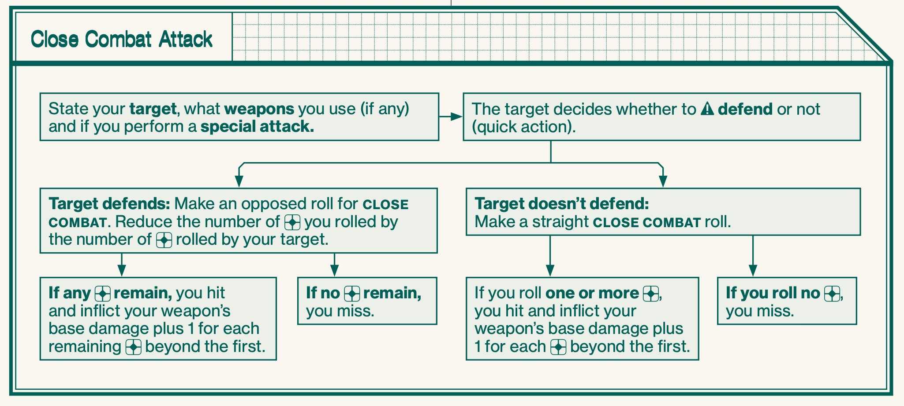
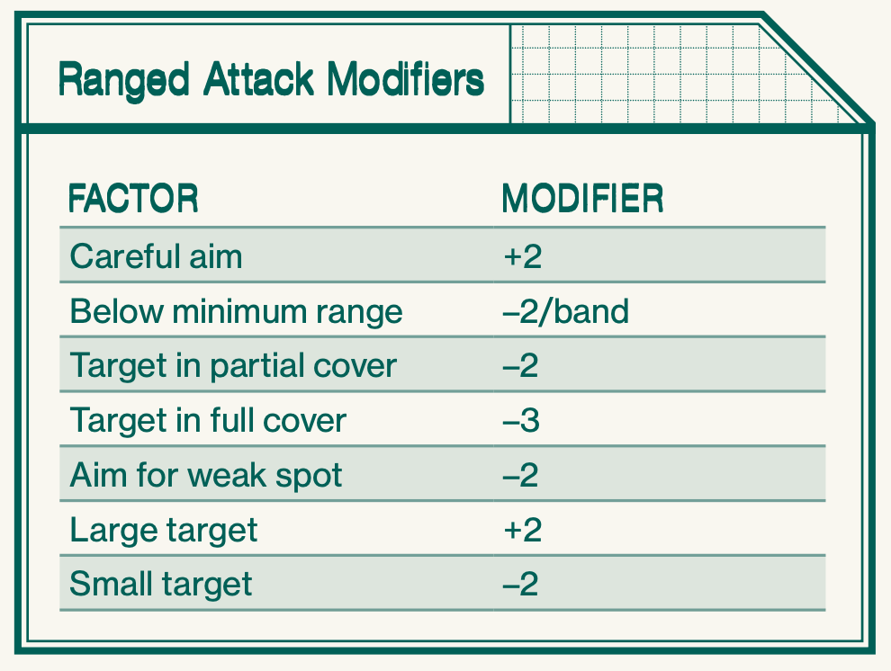
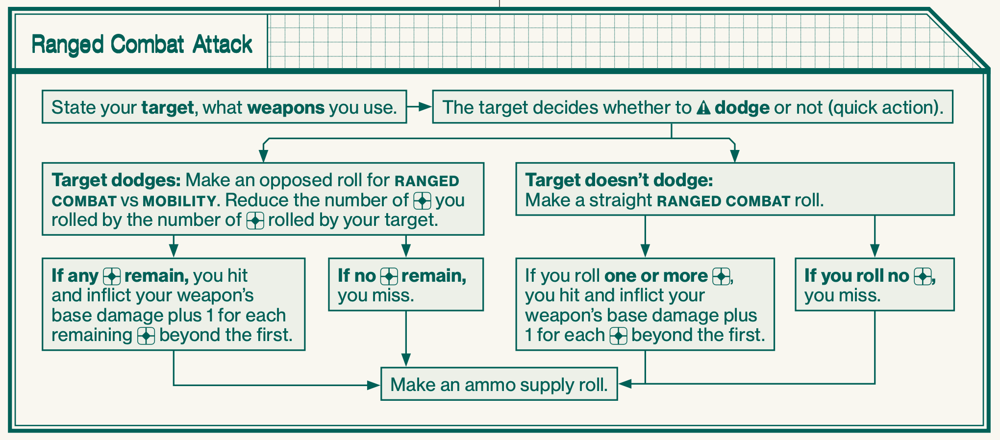
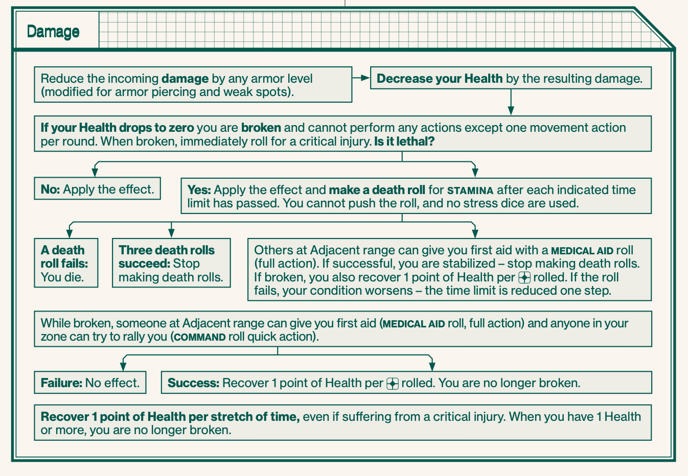
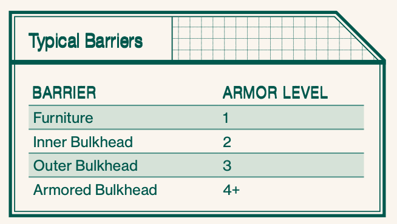
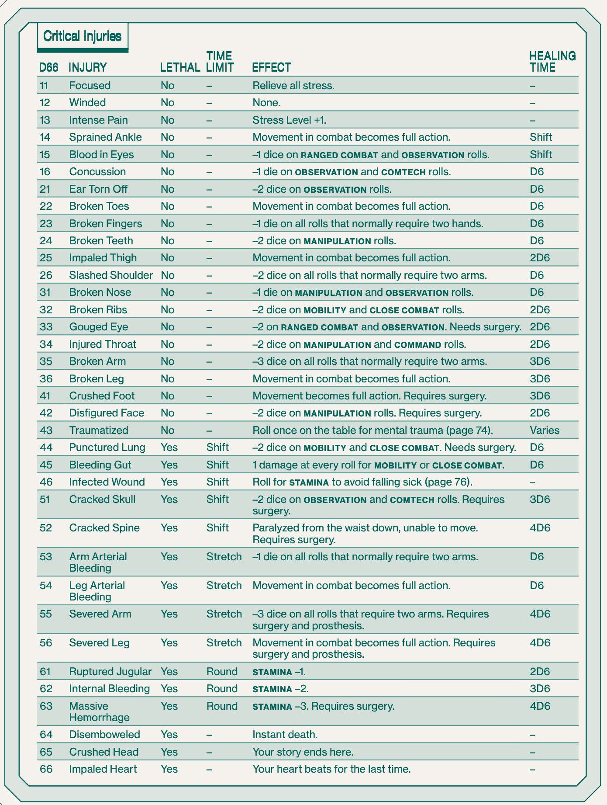
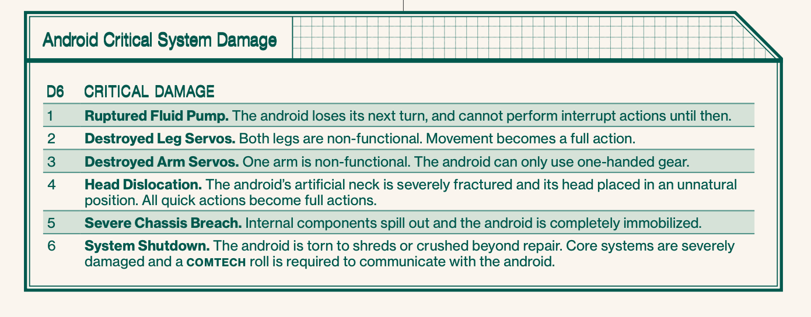

# Evolved Overview

## Skill Roll

## Stress Roll

## Opposed Rolls

In an opposed roll, you need to roll more than your opponent to succeed. You can push the roll even if you’re the target of an opposed roll. In the case of two PCs rolling off against each other, the active PC decides whether to push the roll first, and if so, re-rolls, then the passive PC decides whether to push or not.

## Measuring Time

| Unit    | Duration     | Primary Use |
| ------- | ------------ | ----------- |
| Round   | 5-10 seconds | Combat      |
| Stretch | 5–10 minutes | Stealth     |
| Shift   | 5–10 hours   | Repairs     |

## Measuring Distance

## Stealth Mode

- Detection
  - When within line of sight of an NPC in stealth mode, or vice versa, make a passive open opposed OBSERVATION roll. The roll cannot be pushed, nor trigger stress responses.
  - GM will ask PCs to roll OBSERVATION without telling you why, and roll for the NPC.
  - -2 to roll when in darkness for humans
  - When in a group the highest roll counts
- Searching A Zone
  - If you want to examine something in a zone more closely, to search a room or access a data terminal, you may need to stay several stretches in the zone (or even a full shift), if the adventure text or the GM calls for it.
- Active
  - Active enemies are moving across the map, stalking you or trying to hide from you.
- Passive
  - Passive enemies are not aware of you and are most often stationary, until they spot you or are otherwise alerted to your presence.
- Access Points
  - A crawlspace can be entered by one zone’s worth of movement at any access point marked on the map, just like entering any other zone.
- Sealing Access Points
  - An access point can be sealed shut with a cutting torch.

## Social Mode

When you stop to interact socially with NPCs, or just stop to relieve stress (page 22) or chat among each other, stealth
mode stops. During social mode, the GM estimates how many stretches pass and moves NPCs on the hidden stealth map accordingly. Social mode can also be used when you perform a task that takes more than a stretch to complete. When you start moving around on the map again, stealth mode starts anew

## Combat Mode

1. Draw initiative card - 1 card per speed
2. Players and NPCs take their turn in order starting lowest first
3. On your turn take 2 Quick Actions or 1 Quick Action and 1 Full Action
4. Once everyone has taken their turn, return to step 1

- Surprise
  - If combat starts with an attack, attacker draws #1 initiative card, everyone else draws from the deck
- Ambush
  - Ambushing party draw the lowest initiative cards, everyone else draws from the deck
  - Gain +2 dice for the attack
  - Targets cannot defend or dodge
- Holding Off
  - Swap initiative card with someone else they cannot refuse
- Interrupt Actions
  - Defend and Dodge can be used out of your turn, it costs a Quick Action and you must not already used all of your Quick Actions this turn

### Actions

Each round, you can perform one full action and one quick action, or two quick actions

| TYPE  | ACTION                                              | SKILL USED      |
| ----- | --------------------------------------------------- | --------------- |
| Full  | Attack in close combat                              | CLOSE COMBAT    |
| Full  | Special close combat (disarm, pass, shove, grapple) | CLOSE COMBAT    |
| Full  | Make a ranged attack                                | RANGED COMBAT   |
| Full  | Jump or climb                                       | MOBILITY        |
| Full  | Take full cover                                     | –               |
| Full  | Interact with a terminal                            | COMTECH         |
| Full  | Use machinery                                       | HEAVY MACHINERY |
| Full  | Give first aid                                      | MEDICAL AID     |
| Full  | Persuade someone                                    | MANIPULATION    |
| Full  | Give orders                                         | COMMAND         |
| Full  | Drive a vehicle                                     | PILOTING        |
|       |                                                     |                 |
| Quick | Move into an adjacent zone                          | -               |
| Quick | Move between Short and Adjacent range               | -               |
| Quick | Move to a door or hatch and peek through            | -               |
| Quick | Lock a door or hatch                                | -               |
| Quick | Take partial cover                                  | -               |
| Quick | Defend against a close combat attack                | -               |
| Quick | Aim a ranged attack                                 | -               |
| Quick | Dodge a ranged attack                               | -               |
| Quick | Reload a weapon                                     | -               |
| Quick | Pick up an item from the ground                     | -               |
| Quick | Rally a broken character                            | -               |

### Close combat attack

- Aim for weakspot
  - -2 to roll but Armor level reduced by 1
- Firearms in close combat
  - Roll Close Combat but -2

### Ranged combat attack

- Friendly Fire
  - If you fire at a target Adjacent to another PC and miss, you risk hitting them. Roll for an attack with two base dice, 1 damage per success.
  - If there are several Adjacent targets, randomize which one is hit.
- Ammunition
  - After each attack, make a supply roll for your weapon. When the ammo supply runs out, you need to reload.
- Reload
  - Reloading a firearm is a quick action, unless stated otherwise. You need to track your available reloads on your character sheet.
- Single-Shot
  - Weapons designated as single-shot must be reloaded after each shot – no supply roll is made.
- Full Auto
  - When you fire a burst and hit, without pushing the roll, you can immediately make another attack roll, at the same target or another, as part of the same action. If you hit again (without pushing), you may roll a third time. As soon as you miss, or push a roll, the attack is over. Each attack roll except the first gives you stress level +1. You cannot make more than three attack rolls in a single burst.
  - When firing a burst, you must make an ammo supply roll after each attack roll.

## Damage

- Broken
  - If you drop to zero Health, you are broken – in effect, taken out of the action
  - Immediately roll for a critical injury.
  - While broken, you can make a single move action per round and mumble through the pain but not perform any other actions. You can’t go below zero Health, but any further damage gives you another critical injury.
  - While broken, you cannot gain more stress and you never make panic rolls.
  - There are three ways to get back up after being broken:
    - First Aid
      - Someone at Adjacent range can administer first aid with a MEDICAL AID roll (full action, modified for medical gear). On a success, you are no longer broken and recover 1 point of Health per rolled.
      - If you suffer from a lethal critical injury, you are also stabilized.
      - Can only recover Health when you are broken.
    - Rally
      - Another character in the same zone can try to rally you with a COMMAND roll (quick action). If successful, you are no longer broken and recover 1 point of Health per rolled.
      - Rallying has no effect on critical injuries.
      - Can only recover Health when you are broken.
    - On Your Own
      - If you’re broken (but not dead) and no one gives you first aid, you automatically get back up after one stretch of time and recover 1 point of Health.
    - Recovery
      - As long as you are not fatigued, you automatically recover 1 point of Health per stretch of time while resting in a safe area (even if suffering from a critical injury).
- Critical Injuries
  - When knocked down to zero Health, roll a D66 on the table on page 70. If you roll a critical injury you already have (result #14 and above), re-roll.
  - Death
    - If you suffer a critical injury listed as lethal, you must make a death roll after the listed time limit has passed. If the time limit is round, Death Roll on your every turn, right after you act.
  - Death roll
    - STAMINA cannot push it, and you are not allowed to roll any stress dice. If you fail a death roll, you die. If you succeed, you linger on, but you must make another death roll when the time limit has passed again
  - First Aid
    - To save your life when you have suffered a lethal critical injury, someone must give you first aid MEDICAL AID roll to stabilize you before you fail a death roll.
    - If have critical injury but are no longer broken, you can try to administer first aid on yourself, but with −2 dice.
    - If the roll succeeds, you are stabilized and can stop making death rolls. If you were broken, you also recover 1 point of Health per rolled. The other effects of your critical injury remain until healed.
    - If the roll fails, your condition worsens – the time limit is decreased one step, for example from shift to stretch, or stretch to round. If the time limit was already round, you perish.
  - On Your Own: If you succeed at three death rolls on your own, you survive without help and can stop rolling.

## Synthetics

- In combat, androids act like humans, and they make skill rolls normally. But there are several differences:
  - Attributes: Synthetics generally have higher attribute levels than humans.
  - Skills & Stress: Androids can’t push skill rolls. They don’t suffer stress, don’t have a stress level, and they never make panic rolls.
  - Damage: If a synthetic goes to zero Health, don’t roll for a critical injury. Instead, roll for critical systems damage on the table below. Until the android suffers a system shutdown (result #6), it can continue to operate, only suffering the effects of the critical injury.

## Consumables

- Supply Roll
  -Sometimes, you need to make supply rolls for your gear. This means rolling a number of stress dice equal
  to the current air, ammo or power rating, up to a maximum of six dice. For every rolled, the supply rating of the item
  is decreased by one.
- Air
  - Air supply is not tracked in this starter set. Ammo: Most firearms have magazines with a supply of ammunition. After firing your weapon, make a supply roll. When your ammo runs out, you need to reload (page 17).
- Power
  -Some items require electricity to function. After each use, or as indicated by the item description, you need to make a supply roll. When the power runs out, the item cannot function.

## Gear

- Encumbrance
  - You can carry a number of regular-sized items (weight 1 in the gear lists at the end of this booklet) equal to double your Strength rating without problems. A regular item takes up one row on your character sheet.
- Heavy & Light Items
  - Especially heavy or bulky items count as two or more regular items, and thus take up several rows on your character sheet. At the opposite end of the spectrum, light items count as ½ or even ¼ of a regular item, and several of these can fit on the same row on the character sheet.
- Tiny Items
  - Items that are even smaller than light items are called tiny. They are so small they don’t affect your encumbrance at all. Tiny items still need to be listed on your character sheet.
- Over-Encumbered
  - You can temporarily carry up to twice your normal encumbrance limit, i.e. Strength × 4 regular items. When doing so, your stress level (page 20) increases one step every time you move in a stretch of stealth mode (page 8) or a round of combat (page 12).
