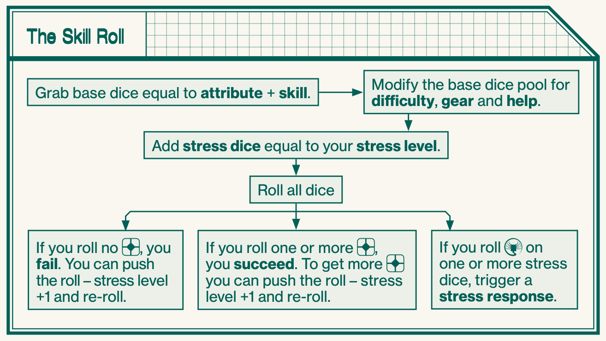
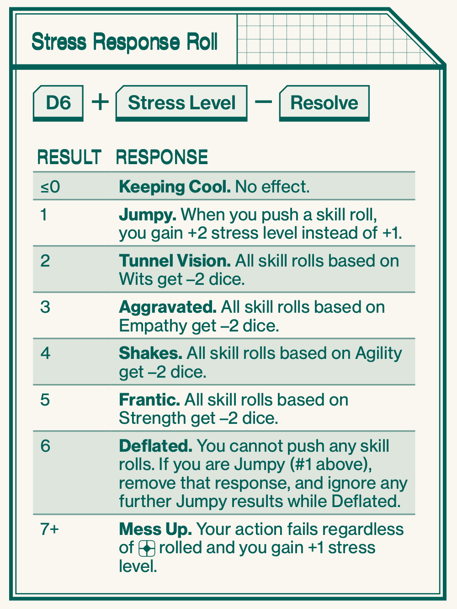
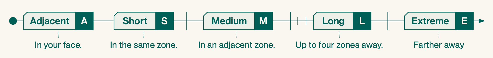
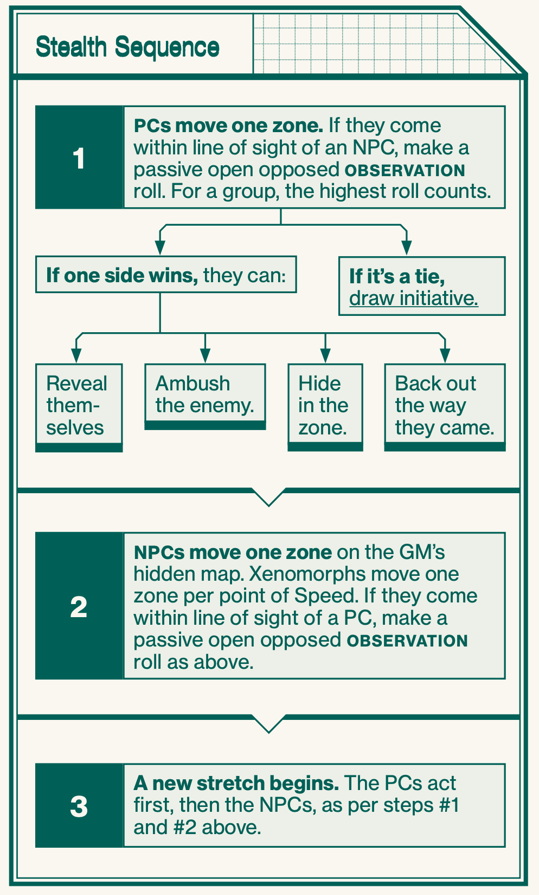

# Evolved Overview

## Skill Roll

## Stress Roll

## Opposed Rolls

In an opposed roll, you need to roll more than your opponent to succeed. You can push the roll even if you’re the target of an opposed roll. In the case of two PCs rolling off against each other, the active PC decides whether to push the roll first, and if so, re-rolls, then the passive PC decides whether to push or not.

## Measuring Time

| Unit    | Duration     | Primary Use |
| ------- | ------------ | ----------- |
| Round   | 5-10 seconds | Combat      |
| Stretch | 5–10 minutes | Stealth     |
| Shift   | 5–10 hours   | Repairs     |

## Measuring Distance

## Stealth Mode

## Social Mode

When you stop to interact socially with NPCs, or just stop to relieve stress (page 22) or chat among each other, stealth
mode stops. During social mode, the GM estimates how many stretches pass and moves NPCs on the hidden stealth map accordingly. Social mode can also be used when you perform a task that takes more than a stretch to complete. When you start moving around on the map again, stealth mode starts anew

## Combat Mode

## Consumables

- Supply Roll
  -Sometimes, you need to make supply rolls for your gear. This means rolling a number of stress dice equal
  to the current air, ammo or power rating, up to a maximum of six dice. For every rolled, the supply rating of the item
  is decreased by one.
- Air
  - Air supply is not tracked in this starter set. Ammo: Most firearms have magazines with a supply of ammunition. After firing your weapon, make a supply roll. When your ammo runs out, you need to reload (page 17).
- Power
  -Some items require electricity to function. After each use, or as indicated by the item description, you need to make a supply roll. When the power runs out, the item cannot function.

## Gear

- Encumbrance
  - You can carry a number of regular-sized items (weight 1 in the gear lists at the end of this booklet) equal to double your Strength rating without problems. A regular item takes up one row on your character sheet.
- Heavy & Light Items
  - Especially heavy or bulky items count as two or more regular items, and thus take up several rows on your character sheet. At the opposite end of the spectrum, light items count as ½ or even ¼ of a regular item, and several of these can fit on the same row on the character sheet.
- Tiny Items
  - Items that are even smaller than light items are called tiny. They are so small they don’t affect your encumbrance at all. Tiny items still need to be listed on your character sheet.
- Over-Encumbered
  - You can temporarily carry up to twice your normal encumbrance limit, i.e. Strength × 4 regular items. When doing so, your stress level (page 20) increases one step every time you move in a stretch of stealth mode (page 8) or a round of combat (page 12).
